مهدی جعفری  Midterm_01 

___

# پردازنده single cycle

### 1. مقدمه

هدف پروژه طراحی پردازنده سینگل سایکل است. یکی از ساده ترین انواع پردازنده که در آن هر دستور در یک سیکل کلاک اجرا می‌شود.

هدف از این پروژه طراحی و پیاده‌سازی یک پردازنده Single-Cycle مطابق مشخصات ارائه‌شده در صورت پروژه با استفاده از زبان توصیف سخت‌افزار Verilog است. این پردازنده دارای یک فایل رجیستر شامل 8 رجیستر 16 بیتی بوده که رجیستر R0 به عنوان Accumulator مورد استفاده قرار می‌گیرد. همچنین پردازنده از حافظه دستور و حافظه داده با ظرفیت 4K×16 بیت پشتیبانی می‌کند.

پردازنده در محیط Modelsim پیاده سازی شده است.

### 2. مشخصات پردازنده

رجیستر فایل شامل 8 ریجیستر 16 بیتی 

توانایی ادرس دهی حافظه به ظرفیت 4K x 16bit

حافظه برنامه به ظرفیت 4K x 16bit

حافظه  داده به ظرفیت 4K x 16bit


جدول دستورات پردازنده:

| Mnemonic | Description                  | Opcode | Function / Imm | Type |
| -------- | ---------------------------- | ------ | -------------- | ---- |
| Load     | R0 ← M[adr-12]               | 0000   | -              | A    |
| Store    | M[adr-12] ← R0               | 0001   | -              | A    |
| Jump     | PC ← adr-12                  | 0010   | -              | A    |
| BranchZ  | If (R0 = Ri) PC[8:0] ← adr-9 | 0100   | -              | B    |
| MoveTo   | Ri ← R0                      | 1000   | 0000000001     | C    |
| MoveFrom | R0 ← Ri                      | 1000   | 0000000010     | C    |
| Add      | R0 ← R0 + Ri                 | 1000   | 0000000100     | C    |
| Sub      | R0 ← R0 - Ri                 | 1000   | 0000001000     | C    |
| And      | R0 ← R0 AND Ri               | 1000   | 0000010000     | C    |
| Or       | R0 ← R0 OR Ri                | 1000   | 0000100000     | C    |
| Not      | R0 ← NOT Ri                  | 1000   | 0001000000     | C    |
| Nop      | No Operation                 | 1000   | 0100000000     | C    |
| Addi     | R0 ← R0 + Imm-12             | 1100   | -              | D    |
| Subi     | R0 ← R0 - Imm-12             | 1101   | -              | D    |
| Andi     | R0 ← R0 AND Imm-12           | 1110   | -              | D    |
| Ori      | R0 ← R0 OR Imm-12            | 1111   | -              | D    |

جدول صحت ALU

| Operation (3-bit) | y (خروجی)  |
| ----------------- | ---------- |
| 000               | In1 + In2  |
| 001               | In1 - In2  |
| 010               | In1 & In2  |
| 011               | In1 \| In2 |
| 100               | NOT In1    |
| 101               | In1        |
| 110               | In2        |

### 3. معماری کلی پردازنده

پردازنده طراحی‌شده از نوع Single-Cycle بوده و تمامی دستورات را در یک سیکل کلاک اجرا می‌کند. در این معماری، هر دستور ابتدا از حافظه برنامه خوانده شده و پس از Decode شدن توسط Control Unit، سیگنال‌های کنترلی لازم برای سایر بخش‌های پردازنده تولید می‌شوند. سپس داده‌های مورد نیاز از رجیستر فایل یا حافظه داده دریافت شده و عملیات مورد نظر توسط واحد ALU انجام می‌شود. در نهایت نتیجه عملیات در رجیستر مقصد یا حافظه داده ذخیره می‌شود.

اجزای اصلی پردازنده عبارت‌اند از:

- Program Counter (PC)
- Instruction Memory
- Control Unit
- Register File
- ALU
- Data Memory
- Sign Extension Units
- Multiplexers

جریان اجرای دستورات در پردازنده به صورت زیر است:

1.مقدار PC آدرس دستور جاری رو مشخص میکنه.

2.از حافظه IM دستور خوانده میشه.

3.فیلد های دستور مثل opcode رو مشخص میکنیم.

4.در Control Unit با توجه به دستور سیگنال های انتخاب رجیستر و  ALUOp و Jump و ... رو مشخص میکنیم.

5.اطلاعات مورد نیاز از رجیستر فایل خونده یا نوشته میشه.

6.عملیات توسط ALU انجام میشه.

7.نتیجه در رجیستر فایل یا حافظه ذخیره میشه.

8.مقدار PC برای اجرای دستور بعدی به‌روزرسانی میشه.

### 4. ماژول‌های طراحی‌شده

#### 4-1. SignExtend_12to16

```
module SignExtend_12to16 (
    input  [11:0] in,
    output [15:0] out
);
    assign out = {{4{in[11]}}, in};  
endmodule
```

این ماژول برای دستورات Type D و Type A کاربرد دارد. 
آدرس های 12بیتی Type A رو به 16 بیتی تبدیل میکنه و داده های 12بیتی Type D رو به 16 بیتی تبدیل میکنه.

#### 4-2. SignExtend_9to16

```
module SignExtend_9to16 (
    input  [8:0] in,
    output [15:0] out
);
    assign out = {{7{in[8]}}, in};
endmodule
```

این ماژول برای دستورات Type C و Type B کاربرد دارد. 
آدرس های 9بیتی Type C رو به 16 بیتی تبدیل میکنه و داده های 9بیتی Type B رو به 16 بیتی تبدیل میکنه.

#### 4-3. Mux2to1

```
module Mux2to1 #(
    parameter WIDTH = 16
) (
    input  [WIDTH-1:0] in0,
    input  [WIDTH-1:0] in1,
    input              sel,
    output [WIDTH-1:0] out
);
    assign out = sel ? in1 : in0;
endmodule
```

#### 4-4. ALU

```
module ALU (
    input  [15:0] In1,
    input  [15:0] In2,
    input  [2:0]  Operation,
    output reg [15:0] Result
);

    always @(*) begin
        case(Operation)
            3'b000: Result = In1 + In2;
            3'b001: Result = In1 - In2;
            3'b010: Result = In1 & In2;
            3'b011: Result = In1 | In2;
            3'b100: Result = ~In1;
            3'b101: Result = In1;
            3'b110: Result = In2;
            default: Result = 16'b0;
        endcase
    end

endmodule
```

این ماژول محاسبات جمع و تفریق و AND و OR و NOT و  انتخاب بین In1 و In2 رو انجام میده.

حالت 111 هم dont care هست و خروجی رو 0 میکنه.                       

#### 4-5. Data_Memory

```
module Data_Memory(
    input              clk,
    input              MemWrite,
    input              MemRead,
    input      [11:0]  Address,
    input      [15:0]  WriteData,
    output reg [15:0]  ReadData
);

    reg [15:0] mem [0:4095];

    always @(*) begin
        if(MemRead)
            ReadData = mem[Address];
        else
            ReadData = 16'b0;
    end

    always @(posedge clk) begin
        if(MemWrite)
            mem[Address] <= WriteData;
    end

endmodule
```

یک حافظه به ظرفیت 4k هست که 16 بیت خط آدرس داره. با توجه به MemRead میاد داده رو روی ReadData بارگذاری میکنه.

روی لبه بالا رونده هم با توجه به MemWrite داخل حافظه می نویسه.

#### 4-6. Instruction_Memory

```
module Instruction_Memory(
    input  [11:0] Address,
    output [15:0] Instruction
);

    reg [15:0] mem [0:4095];

    assign Instruction = mem[Address];
    initial begin
        $readmemh("program.hex", mem);
    end
endmodule
```

یک حافظه به ظرفیت 4k هست که 16 بیت خط آدرس داره. موقع شروع دستورالعمل های داخل program.hex توش بارگذاری میشه.

#### 4-7. PC

```
module PC (
    input              clk,
    input              rst,
    input      [15:0]  NextPC,
    output reg [15:0]  CurrentPC
);
    always @(posedge clk or posedge rst) begin
        if (rst)
            CurrentPC <= 16'b0;
        else
            CurrentPC <= NextPC;
    end
endmodule
```

در لبه صعودی کلاک، مقدار NextPC را در CurrentPC ذخیره می‌کند. در صورت فعال بودن ریست، مقدار CurrentPC به صفر تنظیم می‌شود.

خروجی CurrentPC به عنوان آدرس حافظه دستور استفاده می‌شودمقدار NextPC توسط واحد کنترل جریان (شامل Jump، Branch و افزایش عادی) تعیین می‌شود:

حالت عادی: CurrentPC + 1 ، حالت Branch: آدرس هدف شرطی ، حالت Jump: آدرس هدف بدون شرط

#### 4-8. Register_File

```verilog
module Register_File (
    input              clk,
    input              rst,
    input      [2:0]   ReadReg1,   
    input      [2:0]   ReadReg2,  
    input      [2:0]   WriteReg,
    input      [15:0]  WriteData,
    input              RegWrite,
    output reg [15:0]  ReadData1,
    output reg [15:0]  ReadData2
);

    reg [15:0] regs [0:7]; 

    always @(*) begin
        ReadData1 = regs[ReadReg1];
        ReadData2 = regs[ReadReg2];
    end

    integer i;
    always @(posedge clk or posedge rst) begin
        if (rst) begin
            for (i = 0; i < 8; i = i + 1)
                regs[i] <= 16'b0;
        end
        else if (RegWrite) begin
            regs[WriteReg] <= WriteData;
        end
    end

endmodule
```

یک مجموعه از 8 رجیستر 16 بیتی است که به صورت زیر طراحی شده:

در آن R0 (آدرس 000) نقش Accumulator را دارد و اکثر عملیات روی آن انجام می‌شود و R1 تا R7 (آدرس 001 تا 111): رجیسترهای همه منظوره هستن.

همزمان میشه از دو تا رجیستر فایل خوند چون R0 نقش Accumulator داره ReadReg1 اغلب مواقع `000` هست. از ReadData1, ReadData2 هم داده ها خارج میشوند.

نوشتن هم در لبه بالارونده کلاک انجام میشه. از ریست هم پشتیبانی میکنه.

#### 4-9. Control_Unit

```verilog
module Control_Unit(
    input [3:0] Opcode,
    input [8:0] Func,
    input [2:0] Ri,
    output reg RegWrite,
    output reg MemRead,
    output reg MemWrite,
    output reg Jump,
    output reg Branch,
    output reg ALUSrc,
    output reg MemToReg,
    output reg [2:0] ALUOp,
    output reg [2:0] WriteRegSel
);

always @(*) begin
    RegWrite = 0;
    MemRead = 0;
    MemWrite = 0;
    Jump = 0;
    Branch = 0;
    ALUSrc = 0;
    MemToReg = 0;
    ALUOp = 3'b000;
    WriteRegSel = 3'b000;   

    case(Opcode)
        //....
        4'b1000: begin // TYPE C
            case(Func)
               //......
            endcase
        end
        //....
    endcase

end
endmodule
```

وظیفه Decode کردن دستور و تولید سیگنال‌های کنترلی بخش‌های پردازنده را بر عهده داره.

ورودی اصلی این ماژول Opcode است. در دستورات Type C علاوه بر Opcode، فیلد Function نیز بررسی میشود.

#### 4-10. Processor

ماژول اصلی پردازنده بوده و تمامی بخش‌ های طراحی‌ شده را به یکدیگر متصل میکند. در واقع Processor نقش Datapath پردازنده را بر عهده دارد و جریان اجرای دستورات در آن انجام میشود.

ابتدا مقدار PC به حافظه دستور ارسال شده و دستور از Instruction Memory خوانده می‌شود. سپس فیلدهای مختلف دستور شامل Opcode، Ri، آدرس‌ها و Immediate استخراج می‌شوند.

در Control Unit سیگنالهای کنترلی لازم تولید میشوند. این سیگنالها نحوه عملکرد Register File، ALU، حافظه داده و مالتی‌پلکسرها را مشخص می‌کنند.

در Register File داده‌ های مورد نیاز را از R0 و Ri خوانده و در اختیار ALU قرار می‌ دهد.

مقدار Immediate هم با ماژول مربوطه طولانی میشه.

در ALU عملیات مورد نظر انجام میشود. در دستورات Load و Store، خروجی ALU یا به Data Memory ارسال میشود.

داده خروجی حافظه یا نتیجه ALU توسط مالتی‌پلکسر Write Back انتخاب شده و در رجیستر مقصد ذخیره میشود.

برای اجرای دستور BranchZ، مقدار R0 و Ri با یکدیگر مقایسه میشوند. در صورت برابر بودن و فعال بودن سیگنال Branch، پرش انجام میشود. همچنین در صورت فعال بودن سیگنال Jump، مقدار PC مستقیماً با آدرس مقصد جایگزین میشود.

در حالت عادی نیز مقدار PC در هر سیکل یک واحد افزایش یافته و دستور بعدی اجرا می‌شود.

### 5. تصمیمات طراحی

از ماژول `SignExtend_12to16` برای طولانی کردن Imm12 در دستورات Type D و گسترش آدرس ۱۲ بیتی (Addr12) برای دستورات Type A

از ماژول ` SignExtend_9to16 ` برای گسترش آدرس ۹ بیتی (Addr9) در دستورات Type B

از ماژول مالتی‌پلکسر  برای انتخاب ورودی دوم ALU بین مقدار Ri و Immediate و انتخاب داده‌ای که باید در رجیستر مقصد نوشته شود.

در Processor تنها انتقال اطلاعات و در Control Unit انتخاب ماژول ها انجام میشه.

**نکته:**

در داخل تست بنچ ارسالی استاد، فایل program.hex در خود تست بنچ لود میشد اما در طراحی بنده، بدلیل جلوگیری از ایجاد وقفه و باگ های احتمالی فایل در داخل Instruction_Memory لود میشه.

### 6. شبیه‌سازی و Testbench

#### 6.1 Sign Extension Units

تست ماژول `SignExtend_9to16` :

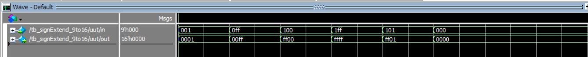

تست ماژول `SignExtend_12to16` :

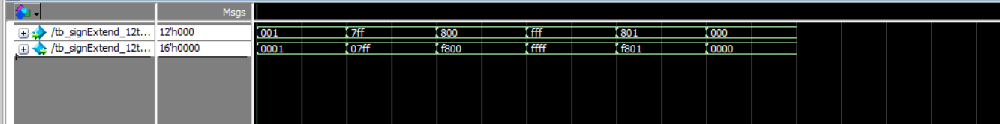

#### 6.2 ALU

تست ماژول `ALU` :

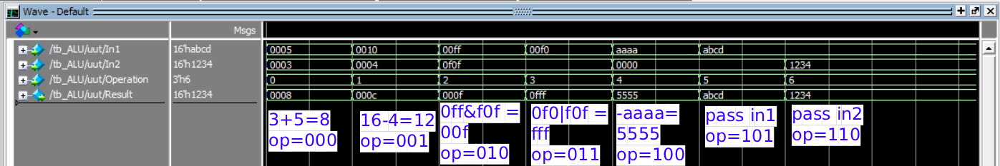

همه عملیات ها به درستی انجام میشود.

#### 6.3 Data_Memory

تست ماژول `Data_Memory` :

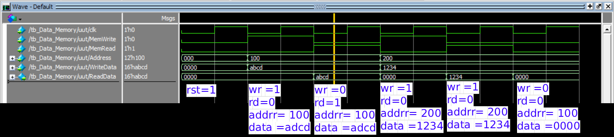

همه عملیات ها به درستی انجام میشود.

#### 6.4 Instruction_Memory

تست ماژول `Instruction_Memory` :

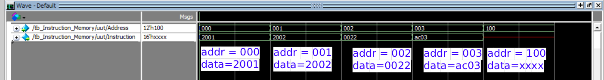

فایل `program.hex` بصورت زیر است:

```
2001
2002
0022
AC03
```

در نتیجه خانه 100 خالی است و همه عملیات ها به درستی انجام میشود.

#### 4-5. PC

تست ماژول `PC` :

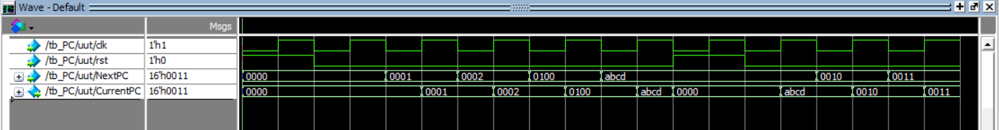

این ماژول شمارنده بعدی رو روی لبه بالارونده قرار میده و همه عملیات ها به درستی انجام میشود.

#### 4-6. Register_File

تست ماژول `Register_File` :

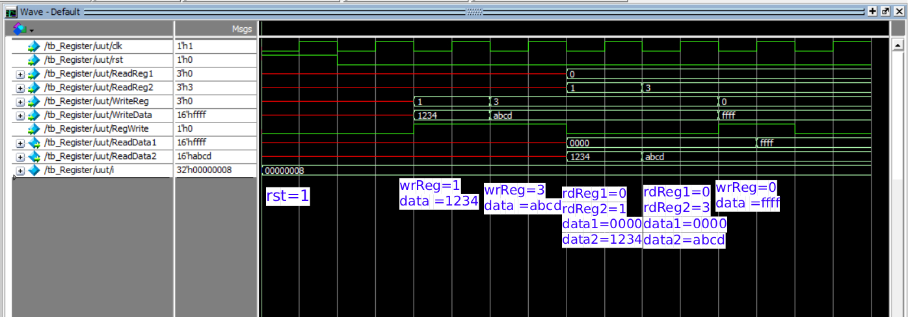

همه عملیات ها به درستی انجام میشود.

#### 4-7. Control_Unit

```verilog
module tb_Control_Unit;

    reg [3:0] Opcode;
    reg [8:0] Func;
    reg [2:0] Ri;

    wire RegWrite, MemRead, MemWrite, Jump, Branch, ALUSrc, MemToReg;
    wire [2:0] ALUOp;
    wire [2:0] WriteRegSel;

    Control_Unit uut (
        .Opcode(Opcode),
        .Func(Func),
        .Ri(Ri),
        .RegWrite(RegWrite),
        .MemRead(MemRead),
        .MemWrite(MemWrite),
        .Jump(Jump),
        .Branch(Branch),
        .ALUSrc(ALUSrc),
        .MemToReg(MemToReg),
        .ALUOp(ALUOp),
        .WriteRegSel(WriteRegSel)
    );

    initial begin
        $monitor("Time=%0t | Op=%b | Func=%b | Ri=%b | RegW=%b | MemR=%b | MemW=%b | J=%b | Br=%b | ALUSrc=%b | M2R=%b | ALUOp=%b | WrReg=%b",
                 $time, Opcode, Func, Ri, RegWrite, MemRead, MemWrite, Jump, Branch, ALUSrc, MemToReg, ALUOp, WriteRegSel);
        Ri = 3'b001;  
        //Type A
        // Load
        Opcode = 4'b0000; Func = 9'b0; #10;
        // Store
        Opcode = 4'b0001; #10;
        // Jump
        Opcode = 4'b0010; #10;
        //Type B
        // BranchZ 
        Opcode = 4'b0100; #10;
        //Type C 
        Opcode = 4'b1000;
        
        Func = 9'b000000001; #10;  // MoveTo
        Func = 9'b000000010; #10;  // MoveFrom
        Func = 9'b000000100; #10;  // Add
        Func = 9'b000001000; #10;  // Sub
        Func = 9'b000010000; #10;  // And
        Func = 9'b000100000; #10;  // Or
        Func = 9'b001000000; #10;  // Not
        Func = 9'b010000000; #10;  // Nop
        //Type D 
        Opcode = 4'b1100; #10;  // Addi
        Opcode = 4'b1101; #10;  // Subi
        Opcode = 4'b1110; #10;  // Andi
        Opcode = 4'b1111; #10;  // Ori

        #10;
        $finish;
    end

endmodule
```

تست ماژول `Control_Unit` :

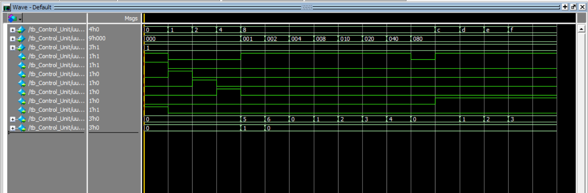

```
# Time=0 | Op=0000 | Func=000000000 | Ri=001 | RegW=1 | MemR=1 | MemW=0 | J=0 | Br=0 | ALUSrc=0 | M2R=1 | ALUOp=000 | WrReg=000
# Time=10 | Op=0001 | Func=000000000 | Ri=001 | RegW=0 | MemR=0 | MemW=1 | J=0 | Br=0 | ALUSrc=0 | M2R=0 | ALUOp=000 | WrReg=000
# Time=20 | Op=0010 | Func=000000000 | Ri=001 | RegW=0 | MemR=0 | MemW=0 | J=1 | Br=0 | ALUSrc=0 | M2R=0 | ALUOp=000 | WrReg=000
# Time=30 | Op=0100 | Func=000000000 | Ri=001 | RegW=0 | MemR=0 | MemW=0 | J=0 | Br=1 | ALUSrc=0 | M2R=0 | ALUOp=000 | WrReg=000
# Time=40 | Op=1000 | Func=000000001 | Ri=001 | RegW=1 | MemR=0 | MemW=0 | J=0 | Br=0 | ALUSrc=0 | M2R=0 | ALUOp=101 | WrReg=001
# Time=50 | Op=1000 | Func=000000010 | Ri=001 | RegW=1 | MemR=0 | MemW=0 | J=0 | Br=0 | ALUSrc=0 | M2R=0 | ALUOp=110 | WrReg=000
# Time=60 | Op=1000 | Func=000000100 | Ri=001 | RegW=1 | MemR=0 | MemW=0 | J=0 | Br=0 | ALUSrc=0 | M2R=0 | ALUOp=000 | WrReg=000
# Time=70 | Op=1000 | Func=000001000 | Ri=001 | RegW=1 | MemR=0 | MemW=0 | J=0 | Br=0 | ALUSrc=0 | M2R=0 | ALUOp=001 | WrReg=000
# Time=80 | Op=1000 | Func=000010000 | Ri=001 | RegW=1 | MemR=0 | MemW=0 | J=0 | Br=0 | ALUSrc=0 | M2R=0 | ALUOp=010 | WrReg=000
# Time=90 | Op=1000 | Func=000100000 | Ri=001 | RegW=1 | MemR=0 | MemW=0 | J=0 | Br=0 | ALUSrc=0 | M2R=0 | ALUOp=011 | WrReg=000
# Time=100 | Op=1000 | Func=001000000 | Ri=001 | RegW=1 | MemR=0 | MemW=0 | J=0 | Br=0 | ALUSrc=0 | M2R=0 | ALUOp=100 | WrReg=000
# Time=110 | Op=1000 | Func=010000000 | Ri=001 | RegW=0 | MemR=0 | MemW=0 | J=0 | Br=0 | ALUSrc=0 | M2R=0 | ALUOp=000 | WrReg=000
# Time=120 | Op=1100 | Func=010000000 | Ri=001 | RegW=1 | MemR=0 | MemW=0 | J=0 | Br=0 | ALUSrc=1 | M2R=0 | ALUOp=000 | WrReg=000
# Time=130 | Op=1101 | Func=010000000 | Ri=001 | RegW=1 | MemR=0 | MemW=0 | J=0 | Br=0 | ALUSrc=1 | M2R=0 | ALUOp=001 | WrReg=000
# Time=140 | Op=1110 | Func=010000000 | Ri=001 | RegW=1 | MemR=0 | MemW=0 | J=0 | Br=0 | ALUSrc=1 | M2R=0 | ALUOp=010 | WrReg=000
# Time=150 | Op=1111 | Func=010000000 | Ri=001 | RegW=1 | MemR=0 | MemW=0 | J=0 | Br=0 | ALUSrc=1 | M2R=0 | ALUOp=011 | WrReg=000
```

در زمان های 0 و 10 و 20 دستورات Type A اجرا میشن، و به درستی در 0 RegW و MemR مقدار 1 میگیرن. در 10 MemW مقدار 1 میگیره، در 20 J مقدار 1 میگیره.

در 30 دستور Type B اجرا میشه ، و برنج 1 میشه
در زمان های 40 و 50 و 60 و 70 و 80 و 90 و 100 و 110 opcode مقدار 1000 میگیره و با توجه به functon سیگنال های مورد نیاز تولید میشن.

از رجیستر های مورد نیاز میخونه و عملیات مورد نظر ALU رو تعیین میکنه. 

#### 4-7. Processor

**برای اطلاع از درستی هر کدام از دستورالعمل ها در 5 بخش مجزا دستورات را تست میکنیم** 

##### 4-7-1. Load & Store

برنامه نوشته شده در  `program.hex`  :

```
C00A    // R0 = 10 (ADDI)
1020    // Data_Memory[0x020] = R0 (STORE)
D00A    // R0 = R0 - 10 -> R0000 (SUBI)
0020    // R0 = Data_Memory[0x020] (LOAD)
```


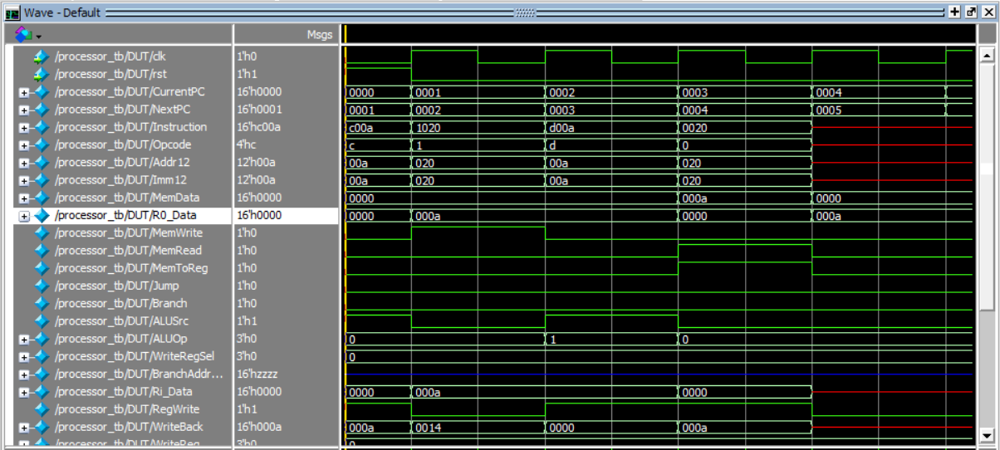

```
# Instruction Memory: program.hex loaded successfully.
# t=0  | RST=1 | PC=0000 | Instr=c00a | R0=0000 | R1=0000 | NextPC=0001
# t=5  | RST=0 | PC=0001 | Instr=1020 | R0=000a | R1=0000 | NextPC=0002
# t=15 | RST=0 | PC=0002 | Instr=d00a | R0=000a | R1=0000 | NextPC=0003
# t=25 | RST=0 | PC=0003 | Instr=0020 | R0=0000 | R1=0000 | NextPC=0004
# t=35 | RST=0 | PC=0004 | Instr=xxxx | R0=000a | R1=0000 | NextPC=0005
# t=45 | RST=0 | PC=0005 | Instr=xxxx | R0=000a | R1=0000 | NextPC=0006
```

در ابتدا بخاطر rst=1 همه ریجستر ها و سیگنال ها صفر میشوند. چون `PC` صفر است دستور c00a اجرا میشود. در کلاک بعدی که t=5 مقدار a در R0 بارگذاری میشود.

در 5 ریست 0 میشود و `pc` هم شروع به کار میکنه، دستور `1020` اجرا میشود و `MemWrite = 1` و عدد `000a` روی آدرس `020` حافظه می نشیند.

در t=15  دستور `d00a` که یعنی `R0` صفر بشه اجرا میشه و در کلاک بعد `R0=0000` میشه.

در t=25 دستور `0020` که یعنی `Load Imm` هست اجرا میشه و  `MemRead = 1` و `MemToReg = 1` می‌شود و عدد `000a` دوباره به `R0` برمی‌گردد.

##### 4-7-2. Type D Commands 

```
C00F    // R0 = 000f (ADDI)
E005    // R0 = 000f AND 0005 -> R0 = 0005 (ANDI)
F010    // R0 = 0005 OR 0010 -> R0 = 0015 (ORI)
D005    // R0 = 0015 - 5 -> R0 = 0010 (SUBI)
```

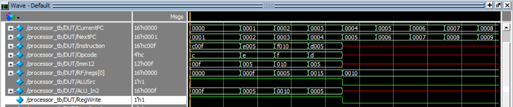

```
# Instruction Memory: program.hex loaded successfully.
# t=0 | RST=1 | PC=0000 | Instr=c00f | R0=0000 | R1=0000 | NextPC=0001
# t=15 | RST=0 | PC=0001 | Instr=e005 | R0=000f | R1=0000 | NextPC=0002
# t=25 | RST=0 | PC=0002 | Instr=f010 | R0=0005 | R1=0000 | NextPC=0003
# t=35 | RST=0 | PC=0003 | Instr=d005 | R0=0015 | R1=0000 | NextPC=0004
# t=45 | RST=0 | PC=0004 | Instr=xxxx | R0=0010 | R1=0000 | NextPC=0005
# t=55 | RST=0 | PC=0005 | Instr=xxxx | R0=0010 | R1=0000 | NextPC=0006
```

عدد 000f رو داخل R0 لود میشه، با 5 ANDI میشه و R0=0005 میشه، بعدش با 10 ORI میشه و R0=0015 میشه، در نهایت هم SUBI 10 میشه و R0=0010 میشه.

این یعنی هر ۴ دستور مالتی‌پلکسر ورودی ALU را درست فعال کرده‌اند.

##### 4-7-3. Registers & Type C Commands 

```
C004    // R0 = 4 (ADDI)
8201    // R1 = 4 (MoveTo R1)
C006    // R0 = 6 (ADDI)
8204    // R0 = R0 + R1 -> R0 = 10 (ADD R1)
8208    // R0 = R0 - R1 -> R0 = 6 (Sub R1)
8240    // R0 = NOT R1 -> NOT = fffb (NOT R1)
```

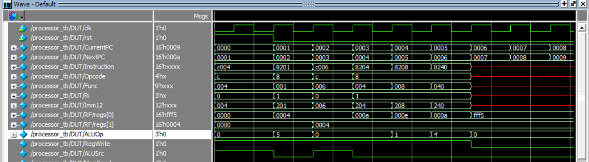

```
# Instruction Memory: program.hex loaded successfully.
# t=0 | RST=1 | PC=0000 | Instr=c004 | R0=0000 | R1=0000 | NextPC=0001
# t=15 | RST=0 | PC=0001 | Instr=8201 | R0=0004 | R1=0000 | NextPC=0002
# t=25 | RST=0 | PC=0002 | Instr=c006 | R0=0004 | R1=0004 | NextPC=0003
# t=35 | RST=0 | PC=0003 | Instr=8204 | R0=000a | R1=0004 | NextPC=0004
# t=45 | RST=0 | PC=0004 | Instr=8208 | R0=000e | R1=0004 | NextPC=0005
# t=55 | RST=0 | PC=0005 | Instr=8240 | R0=000a | R1=0004 | NextPC=0006
# t=65 | RST=0 | PC=0006 | Instr=xxxx | R0=fff5 | R1=0004 | NextPC=0007
# t=75 | RST=0 | PC=0007 | Instr=xxxx | R0=fff5 | R1=0004 | NextPC=0008
```

در `PC=0000` دستور `c004` اجرا میشود و `R0=0004` قرار میگیرد. در `PC=0001` دستور `8201` اجرا و `R1=0004` میشه. در `PC=0002` دستور c006 اجرا `R0=000a` میشه.

در `PC=0003` دستور `8204` اجرا و `R0= a+ 4 = e` قرار میگیره. در `PC=0004` دستور `8204` اجرا و  `R0= e - 4 = a` میشه. در `PC=0005` دستور `8240` اجرا میشه  `R0=~R1 = fffb` میشه.

##### 4-7-4. Jump

```
C005    // R0 = 5
2004    // JUMP to 0004
C009    //
0000    //
C002    // R0 = R0 + 2 = 7
```

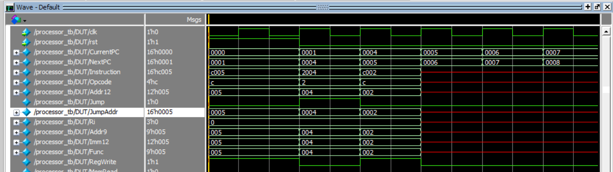

```
# Instruction Memory: program.hex loaded successfully.
# t=0 | RST=1 | PC=0000 | Instr=c005 | R0=0000 | R1=0000 | NextPC=0001
# t=15 | RST=0 | PC=0001 | Instr=2004 | R0=0005 | R1=0000 | NextPC=0004
# t=25 | RST=0 | PC=0004 | Instr=c002 | R0=0005 | R1=0000 | NextPC=0005
# t=35 | RST=0 | PC=0005 | Instr=xxxx | R0=0007 | R1=0000 | NextPC=0006
# t=45 | RST=0 | PC=0006 | Instr=xxxx | R0=0007 | R1=0000 | NextPC=0007
```

در این تست ابتدا R0=0005 میکنیم بعد Jump انجام میدهیم.
همانطور که میبینید jumpaddr به درستی تغییر میکند و جامپ انجام میشود و PC=0002 و PC=0003 انجام نمیشود و نهایتا R0=0007 میشه.

##### 4-7-5. BranchZ

```
C005    // R0 = 5
8201    // R1 = R0 -> R1 = 5 (MoveTo)
4205    // BranchZ: If (R0 == R1) PC[8:0] = 005
C009    //
0000    //
C001    // R0 = R0 + 1 -> R0 = 6
```

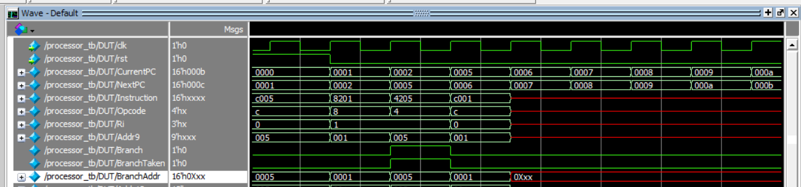

```
# Instruction Memory: program.hex loaded successfully.
# t=0  | RST=1 | PC=0000 | Instr=c005 | R0=0000 | R1=0000 | NextPC=0001
# t=15 | RST=0 | PC=0001 | Instr=8201 | R0=0005 | R1=0000 | NextPC=0002
# t=25 | RST=0 | PC=0002 | Instr=4205 | R0=0005 | R1=0005 | NextPC=0005
# t=35 | RST=0 | PC=0005 | Instr=c001 | R0=0005 | R1=0005 | NextPC=0006
# t=45 | RST=0 | PC=0006 | Instr=xxxx | R0=0006 | R1=0005 | NextPC=0007
# t=55 | RST=0 | PC=0007 | Instr=xxxx | R0=0006 | R1=0005 | NextPC=0008
```

اول 5 در R0 بارگذاری میشه و بعد در PC=0001  مقدار R0 به R1 انتقال داده میشه.

در PC=0002 دستور 4205 اجرا میشه و R0 و R1 مقایسه میکنه(برابر هستند). و به PC=0005 میره برنامه و c001 اجرا میشه و مقدار R0=0006 میشه.

##### 4-7-6. Full Test

```
C005    // R0 = 5  (ADDI)
8201    // R1 = 5  (MoveTo)
1010    // M[0x010] = R0 (Store)
D005    // R0 = 0 (SUBI)
0010    // R0 = M[0x010](LOAD)
F002    // R0 = R0 OR 2 = 7 (ORI)
8208    // PC=0006 | R0 = R0 - R1 2 (SUB)
C006    // R0 = R0 + 6 = 8 (ADDI)
D001    // R0 = R0 - 1 (SUBI)
4208    // PC=0009 | If (R0 == R1)  008 (BranchZ)
2000    // (JUMP)
```

 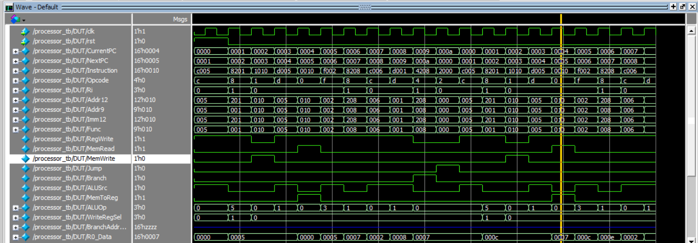

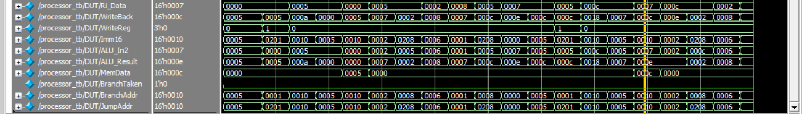

```
# Instruction Memory: program.hex loaded successfully.
# t=0 | RST=1 | PC=0000 | Instr=c005 | R0=0000 | R1=0000 | NextPC=0001
# t=15 | RST=0 | PC=0001 | Instr=8201 | R0=0005 | R1=0000 | NextPC=0002
# t=25 | RST=0 | PC=0002 | Instr=1010 | R0=0005 | R1=0005 | NextPC=0003
# t=35 | RST=0 | PC=0003 | Instr=d005 | R0=0005 | R1=0005 | NextPC=0004
# t=45 | RST=0 | PC=0004 | Instr=0010 | R0=0000 | R1=0005 | NextPC=0005
# t=55 | RST=0 | PC=0005 | Instr=f002 | R0=0005 | R1=0005 | NextPC=0006
# t=65 | RST=0 | PC=0006 | Instr=8208 | R0=0007 | R1=0005 | NextPC=0007
# t=75 | RST=0 | PC=0007 | Instr=c006 | R0=0002 | R1=0005 | NextPC=0008
# t=85 | RST=0 | PC=0008 | Instr=d001 | R0=0008 | R1=0005 | NextPC=0009
# t=95 | RST=0 | PC=0009 | Instr=4208 | R0=0007 | R1=0005 | NextPC=000a
# t=105 | RST=0 | PC=000a | Instr=2000 | R0=0007 | R1=0005 | NextPC=0000
# t=115 | RST=0 | PC=0000 | Instr=c005 | R0=0007 | R1=0005 | NextPC=0001
# t=125 | RST=0 | PC=0001 | Instr=8201 | R0=000c | R1=0005 | NextPC=0002
# t=135 | RST=0 | PC=0002 | Instr=1010 | R0=000c | R1=000c | NextPC=0003
# t=145 | RST=0 | PC=0003 | Instr=d005 | R0=000c | R1=000c | NextPC=0004
# t=155 | RST=0 | PC=0004 | Instr=0010 | R0=0007 | R1=000c | NextPC=0005
# t=165 | RST=0 | PC=0005 | Instr=f002 | R0=000c | R1=000c | NextPC=0006
# t=175 | RST=0 | PC=0006 | Instr=8208 | R0=000e | R1=000c | NextPC=0007
# t=185 | RST=0 | PC=0007 | Instr=c006 | R0=0002 | R1=000c | NextPC=0008
# t=195 | RST=0 | PC=0008 | Instr=d001 | R0=0008 | R1=000c | NextPC=0009
```


دستورهای `0000` و `0001` اجرا شده و هر دو رجیستر R0 و R1 مقدار `0005` میگیرند. 

در دستور 1010 سیگنال `MemWrite` فعال شده و عدد ۵ در آدرس 010 حافظه نوشته میشه. بعد با d005 مقدارR0 صفر می‌شود. در خط 0010 سیگنال `MemRead` فعال شده و دیتای 0005 از حافظه در R0 نوشته میشه.

با اجرای دستورات f002 و 8208 و c006 محاسباتی روی R0 انجام می‌شود که در نهایت مقدار R0 برابر 0008 می‌شود.

 دستور d001 یکی از  R0 کم می‌کند (R0 = 7). دستور بعدی 4208 بررسی می‌کند آیا R0 = R1 است؟ نه . پس برنچ اجرا نمی‌شود وPC به صورت عادی به 000a می‌رود.


 **همه عملیات ها به درستی انجام میشود.**
